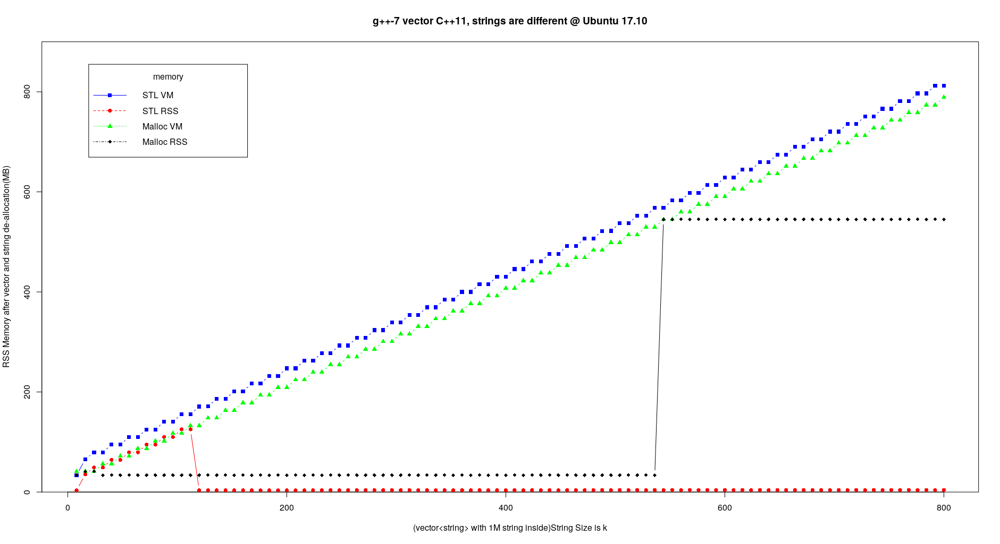
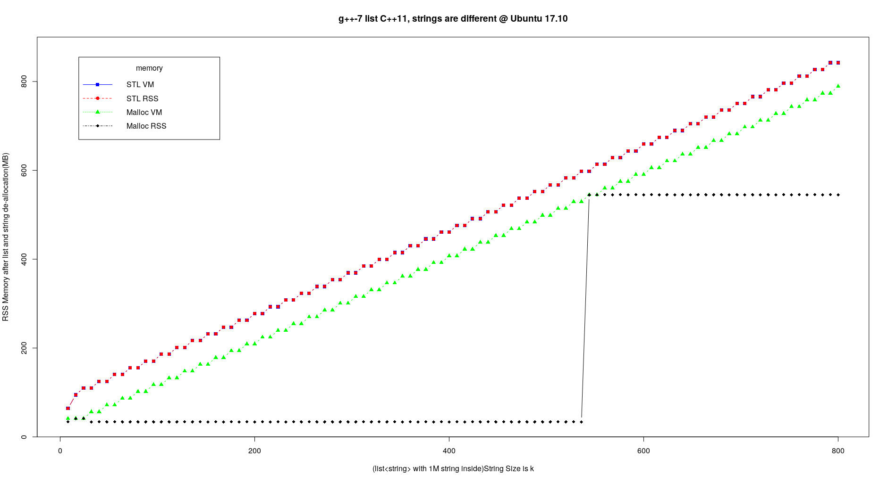
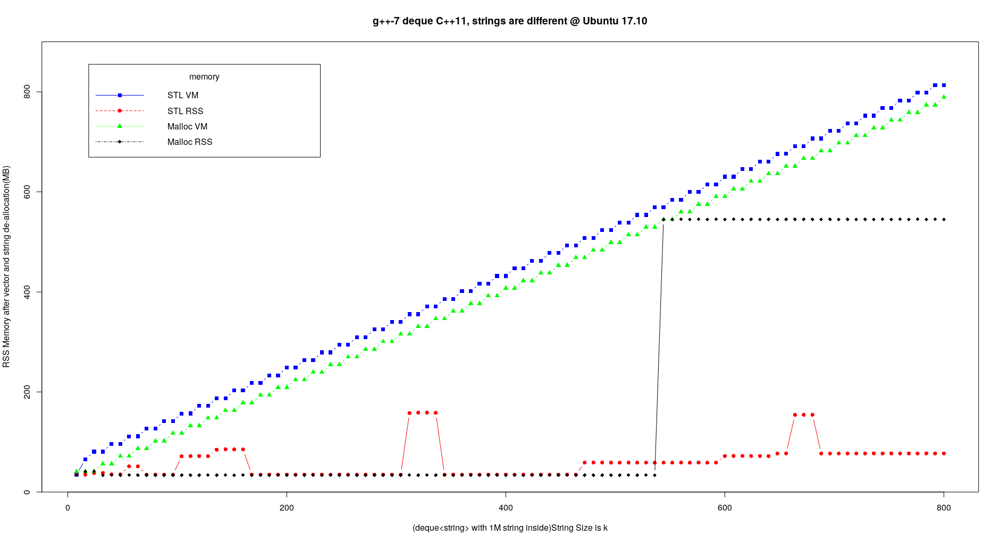

# STL Memory Pool and Malloc Subsystem Analysis

Generally speaking, STL uses two strategies to allocate memory, although HP(Visual C++), SGI(GCC), RW(C++Builder) STLs have different implementations.

To avoid defragmentation and speed up memory allocation, STL matains a memory pool with free memory blocks connnected by a free list. The source code are at [pool_allocator.h](https://github.com/gcc-mirror/gcc/blob/master/libstdc%2B%2B-v3/include/ext/pool_allocator.h#L84).

The freelist properties are defined as below. We can see its size is 16, and max bytes is 128.
```cpp
 78     class __pool_alloc_base
 79     { 
 80     protected:
 81 
 82       enum { _S_align = 8 };
 83       enum { _S_max_bytes = 128 };
 84       enum { _S_free_list_size = (size_t)_S_max_bytes / (size_t)_S_align };
        ...
```

[Here](https://github.com/gcc-mirror/gcc/blob/master/libstdc%2B%2B-v3/include/ext/pool_allocator.h#L243) is the logic of STL memory `allocation`. If `GLIBCXX_FORCE_NEW` is defined or object size is greater than 128 Bytes, just use new/delete(or malloc/free) sub-system; otherwise, try to get an object from the freelist in memory pool. If the object is from memory pool, after deallocation, it is released back to the pool. [Here]((https://github.com/gcc-mirror/gcc/blob/master/libstdc%2B%2B-v3/include/ext/pool_allocator.h#L279)) is the logic of `deallocation`.
 
The following is my test results generated from code [stl_mem.cpp](stl_mem.cpp) and [malloc_mem.cpp](malloc_mem.cpp), where I track memory usage of VM/VSS(Virtual Set Size) and RSS(Resident Set Size) `after STL container is deallocated(or goes out of scope)` or `after memory is reclaimed by free in malloc/free subsystem`. These two metrics are often used by many monitoring tools in companies to track program's memory usage.


## vector



we can see when object size is less than or equal to 128 bytes, the memory usage keeps increasing even after object goes out of scope.

## List



For list, the memory usage keeps increasing.

## deque



Deque is actually an unrolled linked list plus a map(not STL map). So it is between vector and list.

 Also there is an extension to standard library for multithread environment in GCC: [mt_allocator.h](https://github.com/gcc-mirror/gcc/blob/master/libstdc%2B%2B-v3/include/ext/mt_allocator.h#L63)