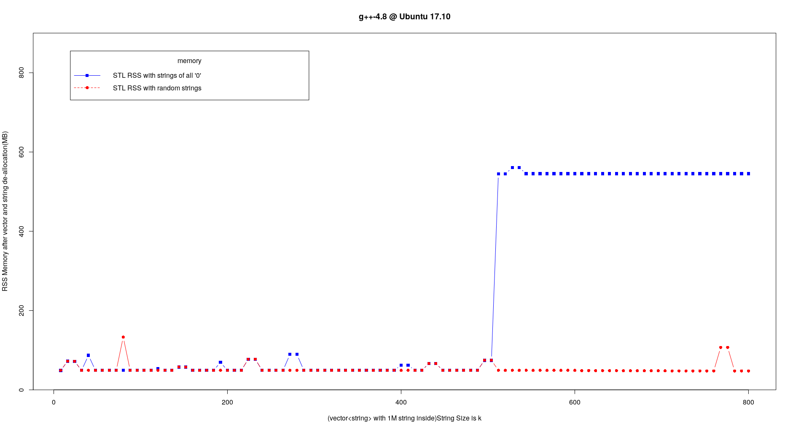

# STL Memory Pool and Malloc Subsystem Analysis

- by Henry Wu

Generally speaking, STL uses two strategies to allocate memory, although HP(Visual C++), SGI(GCC), RW(C++Builder) STLs have different implementations.

To avoid defragmentation and speed up memory allocation, STL matains a memory pool with free memory blocks connnected by a free list. The source code are at [pool_allocator.h](https://github.com/gcc-mirror/gcc/blob/master/libstdc%2B%2B-v3/include/ext/pool_allocator.h#L84).

The freelist properties are defined as below. We can see its size is 16, and max bytes is 128.
```cpp
 78     class __pool_alloc_base
 79     { 
 80     protected:
 81 
 82       enum { _S_align = 8 };
 83       enum { _S_max_bytes = 128 };
 84       enum { _S_free_list_size = (size_t)_S_max_bytes / (size_t)_S_align };
        ...
```

[Here](https://github.com/gcc-mirror/gcc/blob/master/libstdc%2B%2B-v3/include/ext/pool_allocator.h#L243) is the logic of STL memory `allocation`. If `GLIBCXX_FORCE_NEW` is defined or object size is greater than 128 Bytes, just use new/delete(or malloc/free) sub-system; otherwise, try to get an object from the freelist in memory pool. If the object is from memory pool, after deallocation, it is released back to the pool. [Here]((https://github.com/gcc-mirror/gcc/blob/master/libstdc%2B%2B-v3/include/ext/pool_allocator.h#L279)) is the logic of `deallocation`.
 
The following is my test results generated from code [stl_mem.cpp](stl_mem.cpp) and [malloc_mem.cpp](malloc_mem.cpp), where I track memory usage of VM/VSS(Virtual Set Size) and RSS(Resident Set Size) `after STL container is deallocated(or goes out of scope)` or `after memory is reclaimed by free in malloc/free subsystem`. These two metrics are often used by many monitoring tools in companies to track program's memory usage.


## vector


we can see when object size is less than or equal to 128 bytes, the memory usage keeps increasing even after object goes out of scope.

## List


For list, the memory usage keeps increasing.

## deque


Deque is actually an unrolled linked list plus a map(not STL map). So it is between vector and list. We can see from the graphs above, compared with vector, deque has around 30M overhead in RSS.

## Other versions of compilers and OSes

I tested with different compilers: `GCC 4.8`, `GCC 5`, `GCC 6` and `GCC 7`, `Clang++ 6.0` and different operating systemes: `IBM AIX 7.1`, `Sun Solaris 10`, the memory behaviors are very different.

Also STL, or its underlying malloc system, tries to reuse same object as possible as it can. I tested strings with all '0' and random strings. The all-zero strings make program hold more memory in the pool.




## Conclusion

Both STL and malloc subsystem use pool technique to optimize memory allocation/deallocation. Sometimes it just won't return memory back to operating system, but this is `NOT` memory leak, since all the memory are reusable for the process.

Although it is not memory leak, it could cause some issue in production environment. Because the program cannot control how much memory is retained in the pool in that process, it may hold the system memory and starve other processes. Since the memory is not returned to OS, it is `not reusable for other processes` in system-wide. In that case, we need to __`improve our algorithm`__ or __`try memory allocation tools`__([tcmalloc](http://goog-perftools.sourceforge.net/doc/tcmalloc.html), [jemalloc](http://people.freebsd.org/~jasone/jemalloc/bsdcan2006/jemalloc.pdf), [nedmalloc](http://www.nedprod.com/programs/portable/nedmalloc/index.html), [Hoard](http://www.hoard.org/)...) or just simply __`increase system memory`__ :-)!

Especially for data intensive application, test it well to avoid get on-called at night due to OOM issue.


- Also there is an extension to standard library for multithread environment in GCC: [mt_allocator.h](https://github.com/gcc-mirror/gcc/blob/master/libstdc%2B%2B-v3/include/ext/mt_allocator.h#L63)