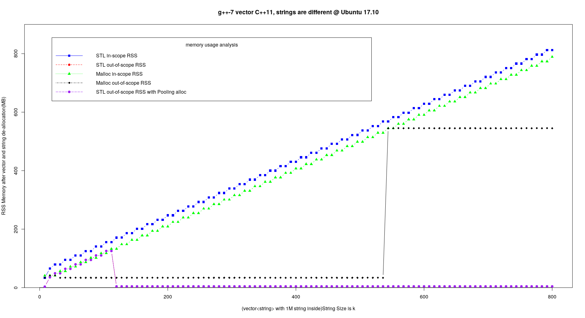
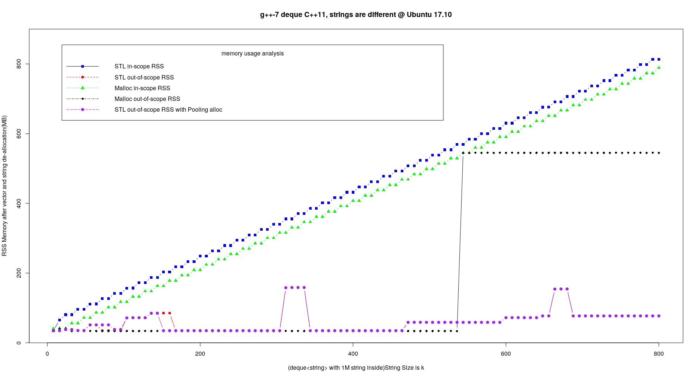

# STL and malloc's Pool Effect

STL Memory Pool and Malloc Subsystem Analysis

- by Henry Wu, 2018

## Preface

There are various STLs: HP(Visual C++), SGI(GCC), RW(C++Builder)... And some companies have their own variants, like [BDE](https://github.com/bloomberg/bde), [EASTL](https://github.com/electronicarts/). This article is only about GCC's STL, aka SGI STL.

Also STL use underlying memory system to allocate/deallocate memory. In different operating systems, the behaviors could be different. In Linux, it use glibc's malloc subsystem(specifically [ptmalloc2](https://github.molgen.mpg.de/git-mirror/glibc/blob/master/malloc/malloc.c#L22). Although there are many difference, I believe the test methods and results would share many common features if you apply it to other STLs in other OS. Anyway, this artilcle is only about Linux, more specifically Ubuntu 17.10.


## Story

From time to time, I got on-called in midnight due to some OOM(Out-of-memory) issue, which was not caused by memory leak. The system seems able to handle the data but program just kill by OS. For instance, you have two programs running as backend services to process a 1GB file. Assuming the system has 2GB free memory left, and your program is bug free and we assume there is no memory overhead. When the data are processed in the pipeline, the second program died of OOM, bacause the first program hogs much memory in its pool. I encountered this several times. After some digging, I found STL/glibc has memory pool which, in some cases, never returns memory to operating system. That is why I am writing this article. 

## Theory

The development of STL memory management is divided into two phases.
 
Before g++3.4, STL has two strategies to allocate memory. To avoid defragmentation and speed up memory allocation, STL matains a memory pool with free memory blocks connnected by a free list. The source code is at [bits/stl_alloc.h](https://github.com/henrywoo/STLandMallocMemory/blob/master/g%2B%2B/3.3/bits/stl_alloc.h#L332).
 
Starting from g++ 3.4, STL by default uses operator new/delete, which finally call glibc's malloc/free [here](https://github.molgen.mpg.de/git-mirror/glibc/blob/master/malloc/malloc.c#L22). As malloc system also uses pool technique. We can still observe the pooling effect. The previous STL allocator code was partially moved to [pool_allocator.h](https://github.com/gcc-mirror/gcc/blob/master/libstdc%2B%2B-v3/include/ext/pool_allocator.h#L84).

### STL Memory Pool

The freelist properties are defined as below. We can see its size is 16, and max bytes is 128.
```cpp
 78     class __pool_alloc_base
 79     { 
 80     protected:
 81 
 82       enum { _S_align = 8 };
 83       enum { _S_max_bytes = 128 };
 84       enum { _S_free_list_size = (size_t)_S_max_bytes / (size_t)_S_align };
        ...
```

[Here](https://github.com/gcc-mirror/gcc/blob/master/libstdc%2B%2B-v3/include/ext/pool_allocator.h#L243) is the logic: if `GLIBCXX_FORCE_NEW` is defined or object size is greater than 128 Bytes, just use new/delete(or malloc/free) sub-system; otherwise, try to get an object from the freelist in memory pool. If the object is from memory pool, after deallocation, it is released back to the pool. [Here]((https://github.com/gcc-mirror/gcc/blob/master/libstdc%2B%2B-v3/include/ext/pool_allocator.h#L279)) is the logic of `deallocation`.

The following is my test results generated from code [stl_mem.cpp](src/stl_mem.cpp) and [malloc_mem.cpp](src/malloc_mem.cpp), where I track memory usage of in-scope and out-of-scope RSS(Resident Set Size) `after STL container is deallocated(or goes out of scope)` or `after memory is reclaimed by free in malloc/free subsystem`. RSS is often used by many monitoring tools in companies to track program's memory usage. Although it contains memory by shared library, in my test case, that part is neglectable(only 3MB), so it is a reliable metric for the test.

## Test Plan

Setup:

- machine: Ubuntu 17.10
- g++: 7.3
- C++ standard: 11

Code:

```
void test_stl_mem(int k){
  srand(time(NULL));
  STL_CONTAINER strvec;
  static const int LOOPSIZE = 1000000;
  for(long long i = 0; i < LOOPSIZE; ++i){
    string out(k,'0');
#ifndef ALL_ZERO_STRING
    out[rand()%k] = rand()%26+'0';
#endif
    strvec.push_back(out);
  }
  double vm, rss;
  process_mem_usage(vm, rss);
  sz[idx_sz++]=k, rss0[idx_rss0++]=rss;
}
```
What the function `test_stl_mem` above does is:

1. create an empty STL container
2. create a randomized(optional) string with size equal to k, which is passed from main function below
3. push back the string to the STL container
4. repeat step 2 and 3 for 1 million times
5. record memory(RSS) usage, which is called `in-scope RSS` in this test

 
STL_CONTAINER is a macro defined as follows:

```
typedef __gnu_cxx::__pool_alloc<string> POOL;
#define STL_CONTAINER vector<string, POOL>
```

I replace it with `list`, `deque` with and without the POOL allocator to get more test data.

In main function, we just call `test_stl_mem` with k from 8 to 800, and record RSS memory usage after the call, which is called `out-of-scope RSS` in this test.

```
int main(int argc, char** argv){
  for (int k=8; k<=800;k+=8){
    test_stl_mem(k);
    double vm1, rss;
    process_mem_usage(vm1, rss);
    rss1[idx_rss1++] = rss;
  }
  ...
  return 0;
}
```

I did the similar tests for malloc/free, the code is here at [malloc_mem.cpp](src/malloc_mem.cpp).

## Test Results

I output the in-scope and out-of-scope RSS and use `R` to draw graphs. The x axis is the size of string, y axis is the RSS memory.

### vector



STL in-scope RSS keeps increasing as size of string increases, which is not surprising. 

The purple-dot line displays, when pool allocator is used, RSS values after all STL objects are `deallocated`. Observing the purple-dot line, we can see `when object size is less than or equal to 128 bytes`, the memory usage keeps increasing even after object goes out of scope, which is expected too.

Another observation is malloc/free's pool effect. malloc/free actually doesn't return back all memory to OS even after all objects are freed. Before string size is greater than some threshold value of 500+, malloc/free will hold around 30~40MB memory, and after that, the value jumps to almost 600MB. You can see the jump of the black dot line in the graph. This is not surprising either.

**What surprised me is the default STL out-of-scope RSS without pool allocator almost overlaps with the one with pool allocator!** We can see the red and purple dot lines are very very close. I am using g++ 7.3 so it should the underlying malloc/free subsystem. But the behavior is still like the old g++3.3. One speculation is malloc/free use very similar pool stragey with STL pool allocator. I need some time to verify it. Or please email me wufuheng AT gmail.com or send a Pull Request if you know the answer. Thanks!

### List


For list, with STL default allocator, RSS memory usage keeps increasing! This is kind of surprising. The memory is never returned back to OS! Fortunately, with pool allocator, the memory usage improved greatly. Looking at the purple dots, the upward line just plummets when string size is greater than some threshold value of 128. It is almost like the one in vector case. It seems g++3.3 can beat g++7.3 in this test, which is very interesting! 

### deque



Deque is actually an unrolled linked list plus a map(not STL map). So it is between vector and list. We can see from the graphs above, compared with vector, deque has around 30M overhead in RSS.


## Other versions of compilers and OSes

I tested with different compilers: `GCC 4.8`, `GCC 5`, `GCC 6` and `GCC 7`, `Clang++ 6.0` and different operating systemes: `IBM AIX 7.1`, `Sun Solaris 10`. `GCC 7` and `Clang++ 6.0` have almost the same behavior, but others behave very very differently.

Also STL, or its underlying malloc system, tries to reuse same objects as possible as it can. I tested strings with all '0' and random strings. The all-zero strings make program hold more memory in the pool.


## Conclusion

Both STL and malloc subsystem use pool technique to optimize memory allocation/deallocation. Sometimes it just won't return memory back to operating system, but this is __`NOT` memory leak__, since all the memory are reusable for the process.

Although it is not memory leak, it could cause some issue in production environment. Because the program cannot control how much memory is retained in the pool in that process, it may hold the system memory and starve other processes. Since the memory is not returned to OS, it is `not reusable for other processes` in system-wide. In that case, we need to __`improve our algorithm`__ or __`try other memory allocation tools`__([tcmalloc](http://goog-perftools.sourceforge.net/doc/tcmalloc.html), [jemalloc](http://people.freebsd.org/~jasone/jemalloc/bsdcan2006/jemalloc.pdf), [nedmalloc](http://www.nedprod.com/programs/portable/nedmalloc/index.html), [Hoard](http://www.hoard.org/)...) or just simply __`increase system memory`__ :-)!


- Lesson learned:

Especially for data intensive application, before deploying to production, don't forget to test it fully to avoid get on-called at night due to OOM issue. No memory leak doesn't mean no memory hog.

