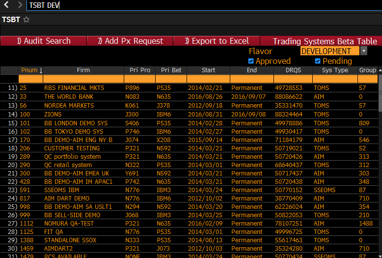
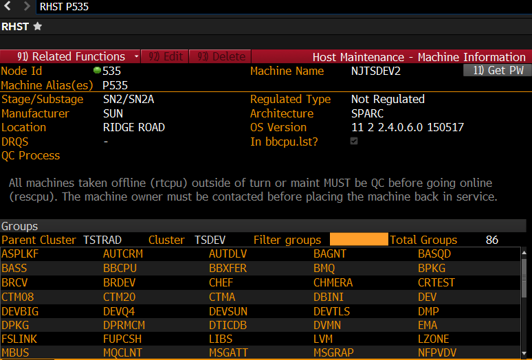
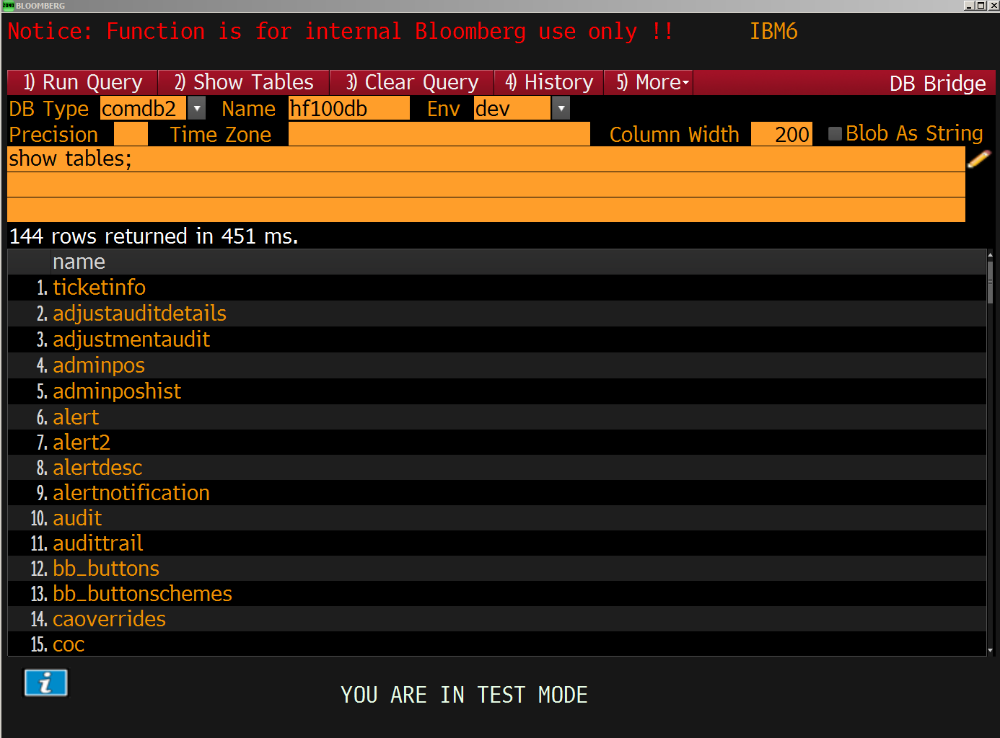
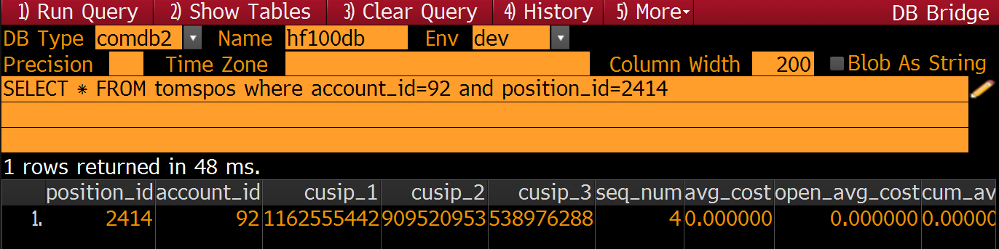
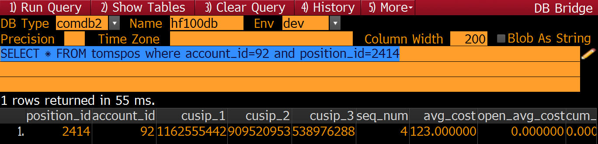

# DB Comparison for Regression Test
Fuheng  
August 31, 2016  


# EOD TEAM - Regression Test Tool

## ASCII Dump Comparison


`TSBT DEV` Can see all dev machines and firms.

I can see my Zion copy in ibm6 which will expire on 2016/09/08.

All setting in ibm6 for Zion will be erase on the expiry date.




BXT is not a trading system command. It won't change anything in trading system. It is an analytic command.

For 290, it lives in p535. with `RHST P535`, we can see Px290 exists in machine NJTSDEV2.



So we go to NJTSDEV2 and dump the tables:

```
[1704][njtsdev2][330][bash](15:26:25)[0](fwu131) : ~/mb/m_comparefpdb/src
$m_dumphfdb.tsk -p 290 -f /ts/pod/px/px290/ext/hf290dump -a
Dumping the table tomspos in single-threaded mode.Dumping the table
pricing in single-threaded mode.
Dumping the table securityinfo in single-threaded mode.
Dumping the table fx in single-threaded mode.
Dumping the table mop in single-threaded mode.Dumping the table fx3 in single-threaded mode.
Dumping the table Dumping the table cavcoffline in single-threaded mode.

fx2 in single-threaded mode.
Dumping the table cavcticketdata in single-threaded mode.
Dumping the table nasdaq_mmpr in single-threaded mode.
Dumping the table misc_pos in single-threaded mode.
Dumping the table cavclock in single-threaded mode.
Dumping the table tws_strategy in single-threaded mode.
0 cavclock records dumped into /ts/pod/px/px290/ext/hf290dump.cavclock
5829 tws_strategy records dumped into /ts/pod/px/px290/ext/hf290dump.tws_strategy
0 nasdaq_mmpr records dumped into /ts/pod/px/px290/ext/hf290dump.nasdaq_mmpr
5 cavcoffline records dumped into /ts/pod/px/px290/ext/hf290dump.cavcoffline
134 fx records dumped into /ts/pod/px/px290/ext/hf290dump.fx
268 fx3 records dumped into /ts/pod/px/px290/ext/hf290dump.fx3
274 fx2 records dumped into /ts/pod/px/px290/ext/hf290dump.fx2
6264 cavcticketdata records dumped into /ts/pod/px/px290/ext/hf290dump.cavcticketdata
73484 misc_pos records dumped into /ts/pod/px/px290/ext/hf290dump.misc_pos
22940 mop records dumped into /ts/pod/px/px290/ext/hf290dump.mop
35368 securityinfo records dumped into /ts/pod/px/px290/ext/hf290dump.securityinfo
72280 tomspos records dumped into /ts/pod/px/px290/ext/hf290dump.tomspos
72281 pricing records dumped into /ts/pod/px/px290/ext/hf290dump.pricing
```

But px290's database is too big:

```
[1743][njtsdev2][330][bash](09:37:58)[0](fwu131) : ~/mb/m_comparefpdb/src
$du -m /ts/pod/px/px290/ext/hf290dump*
0       /ts/pod/px/px290/ext/hf290dump.cavclock
0       /ts/pod/px/px290/ext/hf290dump.cavcoffline
21      /ts/pod/px/px290/ext/hf290dump.cavcticketdata
0       /ts/pod/px/px290/ext/hf290dump.fx
0       /ts/pod/px/px290/ext/hf290dump.fx2
0       /ts/pod/px/px290/ext/hf290dump.fx3
28      /ts/pod/px/px290/ext/hf290dump.misc_pos
66      /ts/pod/px/px290/ext/hf290dump.mop
0       /ts/pod/px/px290/ext/hf290dump.nasdaq_mmpr
0       /ts/pod/px/px290/ext/hf290dump.new.cavclock
0       /ts/pod/px/px290/ext/hf290dump.new.cavcoffline
21      /ts/pod/px/px290/ext/hf290dump.new.cavcticketdata
0       /ts/pod/px/px290/ext/hf290dump.new.fx
0       /ts/pod/px/px290/ext/hf290dump.new.fx2
0       /ts/pod/px/px290/ext/hf290dump.new.fx3
28      /ts/pod/px/px290/ext/hf290dump.new.misc_pos
66      /ts/pod/px/px290/ext/hf290dump.new.mop
0       /ts/pod/px/px290/ext/hf290dump.new.nasdaq_mmpr
444     /ts/pod/px/px290/ext/hf290dump.new.pricing
132     /ts/pod/px/px290/ext/hf290dump.new.securityinfo
444     /ts/pod/px/px290/ext/hf290dump.new.tomspos
4       /ts/pod/px/px290/ext/hf290dump.new.tws_strategy
444     /ts/pod/px/px290/ext/hf290dump.pricing
132     /ts/pod/px/px290/ext/hf290dump.securityinfo
444     /ts/pod/px/px290/ext/hf290dump.tomspos
4       /ts/pod/px/px290/ext/hf290dump.tws_strategy
```

Running this command take too long time:

```
$./m_comparefpdb.sundev1.tsk -m HFDB_FILE -c db_compare_config -l /ts/pod/px/px290/ext/hf290dump -r /ts/pod/px/px290/ext/hf290dump.new -p 290
```


So I am going to use px100 instead:
```
[1756][ibm6][9][bash](09:51:42)[0](fwu131) : ~
$m_dumphfdb.tsk -p 100 -f /ts/pod/px/px100/ext/hf100dump -a
Dumping the table tomspos in single-threaded mode.Dumping the table pricing in single-threaded mode.

Dumping the table securityinfo in single-threaded mode.
Dumping the table mop in single-threaded mode.
Dumping the table fx in single-threaded mode.
Dumping the table fx2 in single-threaded mode.
Dumping the table fx3 in single-threaded mode.
Dumping the table cavcoffline in single-threaded mode.
Dumping the table cavcticketdata in single-threaded mode.
Dumping the table nasdaq_mmpr in single-threaded mode.
Dumping the table Dumping the table cavclock in single-threaded mmiscod_pe.os in single-threaded mode.

Dumping the table tws_strategy in single-threaded mode.
6 fx2 records dumped into /ts/pod/px/px100/ext/hf100dump.fx2
0 cavcticketdata records dumped into /ts/pod/px/px100/ext/hf100dump.cavcticketdata
0 cavcoffline records dumped into /ts/pod/px/px100/ext/hf100dump.cavcoffline
0 fx records dumped into /ts/pod/px/px100/ext/hf100dump.fx
15 fx3 records dumped into /ts/pod/px/px100/ext/hf100dump.fx3
0 cavclock records dumped into /ts/pod/px/px100/ext/hf100dump.cavclock
0 nasdaq_mmpr records dumped into /ts/pod/px/px100/ext/hf100dump.nasdaq_mmpr
6011 tws_strategy records dumped into /ts/pod/px/px100/ext/hf100dump.tws_strategy
2175 misc_pos records dumped into /ts/pod/px/px100/ext/hf100dump.misc_pos
1812 securityinfo records dumped into /ts/pod/px/px100/ext/hf100dump.securityinfo
2175 tomspos records dumped into /ts/pod/px/px100/ext/hf100dump.tomspos
2175 pricing records dumped into /ts/pod/px/px100/ext/hf100dump.pricing
3961 mop records dumped into /ts/pod/px/px100/ext/hf100dump.mop
[1759][ibm6][9][bash](09:57:46)[0](fwu131) : ~
$du -m /ts/pod/px/px100/ext/hf100dump*
0.00    /ts/pod/px/px100/ext/hf100dump.cavclock
0.00    /ts/pod/px/px100/ext/hf100dump.cavcoffline
0.00    /ts/pod/px/px100/ext/hf100dump.cavcticketdata
0.00    /ts/pod/px/px100/ext/hf100dump.fx
0.01    /ts/pod/px/px100/ext/hf100dump.fx2
0.02    /ts/pod/px/px100/ext/hf100dump.fx3
0.83    /ts/pod/px/px100/ext/hf100dump.misc_pos
11.43   /ts/pod/px/px100/ext/hf100dump.mop
0.00    /ts/pod/px/px100/ext/hf100dump.nasdaq_mmpr
13.67   /ts/pod/px/px100/ext/hf100dump.pricing
6.74    /ts/pod/px/px100/ext/hf100dump.securityinfo
13.50   /ts/pod/px/px100/ext/hf100dump.tomspos
4.38    /ts/pod/px/px100/ext/hf100dump.tws_strategy
```


LOGD => select internal beta machine => Express Login
=> LOGD = >Input `IBM6` => ZOMO



Use ZOMO to query:



You cannot modify database from ZOMO. If you want, you have to use `comdb2sql`.

Use comdb2sql to query:

```
[1761][ibm6][9][bash](10:41:29)[0](fwu131) : ~
$comdb2sql hf100db "SELECT * FROM tomspos where account_id=92 and position_id=2414"
(position_id=2414, account_id=92, cusip_1=1162555442, cusip_2=909520953, cusip_3=538976288, seq_num=4, avg_cost=0.000000, open_avg_cost=0.000000, cum_avg_cost=0.000000, open_cum_avg_cost=0.000000, real_pl=0.000000, open_real_pl=0.000000, cum_real_pl=0.000000, open_cum_real_pl=0.000000, num_buys=0, num_sells=0, buy_volume=0.000000, sell_volume=0.000000, first_trade_date=0, last_trade_date=20140306, pos=0.000000, open_pos=0.000000, settled_pos=0.000000, open_settled_pos=0.000000, ...)
```

### ASCII UPDATE TEST

Then update database:

```
[1762][ibm6][9][bash](10:44:23)[0](fwu131) : ~
$comdb2sql hf100db "update tomspos set avg_cost=123 where account_id=92 and position_id=2414"
(rows updated='1')
```

Go back zomo to check:



Then regenerate new ASCII dump:

```
[1763][ibm6][9][bash](10:46:33)[0](fwu131) : ~
$m_dumphfdb.tsk -p 100 -f /ts/pod/px/px100/ext/hf100dump_new -a
Dumping the table tomspos in single-threaded mode.Dumping the table pricing in single-threaded mode.

Dumping the taDumblepi ng the table securityinfo in single-threamodped mo idn se.ingle-threaded mode.

Dumping the table Dumfxp iing n sinthe gletab-threlead ed mode.
fx2 in single-threaded mode.
Dumping the table fx3 in single-threaded mode.
DDuumping tmpihe ng thtabe tale ble ccaavcvcofftilinckeet idan tas iingln se-tinglhree-tadhreaded edmo mode.de.

Dumping the table nasdaq_mmpr in single-threaded modDumpine.g the table misc_pos in single-threaded mode.

DDumping the tablue mping the table tws_strategyc in savcingle-thrlocke inaded si mode.ngle-threaded mode.

6 fx2 records dumped into /ts/pod/px/px100/ext/hf100dump_new.fx2
0 fx records dumped into /ts/pod/px/px100/ext/hf100dump_new.fx
6011 tws_strategy records dumped into /ts/pod/px/px100/ext/hf100dump_new.tws_strategy
0 cavclock records dumped into /ts/pod/px/px100/ext/hf100dump_new.cavclock
0 nasdaq_mmpr records dumped into /ts/pod/px/px100/ext/hf100dump_new.nasdaq_mmpr
0 cavcoffline records dumped into /ts/pod/px/px100/ext/hf100dump_new.cavcoffline
0 cavcticketdata records dumped into /ts/pod/px/px100/ext/hf100dump_new.cavcticketdata
15 fx3 records dumped into /ts/pod/px/px100/ext/hf100dump_new.fx3
2175 misc_pos records dumped into /ts/pod/px/px100/ext/hf100dump_new.misc_pos
1812 securityinfo records dumped into /ts/pod/px/px100/ext/hf100dump_new.securityinfo
2175 tomspos records dumped into /ts/pod/px/px100/ext/hf100dump_new.tomspos
3961 mop records dumped into /ts/pod/px/px100/ext/hf100dump_new.mop
2175 pricing records dumped into /ts/pod/px/px100/ext/hf100dump_new.pricing
```

Run comparison task:

```
[1770][ibm6][9][bash](11:02:46)[0](fwu131) : ~/mb/m_comparefpdb/src
$./m_comparefpdb.ibm.tsk -m HFDB_FILE -c db_compare_config -l /ts/pod/px/px100/ext/hf100dump -r /ts/pod/px/px100/ext/hf100dump_new -p 100
Ignoring following fields in comparison: id,pricing_id,position_id,security_id,objid_1,objid_2,objid_3,fmdb33_exists,fmdb39_exists,pos_flags,deal_id,dept,suubflag,db_status,has_umtm_px,fmdb30_bb_unique_id,can_pool_partial_ppy_assumption,can_pool_refinance_rate,fmdb30_icoc_secinc,faskpx,faskyld,fbidpx,fbidyld,fr
Adding field tomspos.open_pos to the list of comparison fields, values to be compared with epsilon 0.001, zero values will be compared.
Adding field tomspos.pos to the list of comparison fields, values to be compared with epsilon 0.001, zero values will be compared.
Reconstituting database dump from /ts/pod/px/px100/ext/hf100dump.tomspos
Reconstituting database dump from /ts/pod/px/px100/ext/hf100dump.pricing
Reconstituting database dump from /ts/pod/px/px100/ext/hf100dump.mop
Reconstituting database dump from /ts/pod/px/px100/ext/hf100dump.fx
Reconstituting database dump from /ts/pod/px/px100/ext/hf100dump.fx2
Reconstituting database dump from /ts/pod/px/px100/ext/hf100dump.fx3
Reconstituting database dump from /ts/pod/px/px100/ext/hf100dump.tws_strategy
Reconstituting database dump from /ts/pod/px/px100/ext/hf100dump_new.tomspos
Reconstituting database dump from /ts/pod/px/px100/ext/hf100dump_new.pricing
Reconstituting database dump from /ts/pod/px/px100/ext/hf100dump_new.mop
Reconstituting database dump from /ts/pod/px/px100/ext/hf100dump_new.fx
Reconstituting database dump from /ts/pod/px/px100/ext/hf100dump_new.fx2
Reconstituting database dump from /ts/pod/px/px100/ext/hf100dump_new.fx3
Reconstituting database dump from /ts/pod/px/px100/ext/hf100dump_new.tws_strategy
Total number or records in left source:
Pricing: 2175
Position: 2175
Security: 0
Fx: 0
Fx2: 6
Fx3: 15
Mop: 3961
Cavclock: 0
Cavcoffline: 0
Cavcticketdat: 0
Miscpos: 0
Nasdaq_mmpr: 0
Tws_strategy: 6011
Total number or records in right source:
Pricing: 2175
Position: 2175
Security: 0
Fx: 0
Fx2: 6
Fx3: 15
Mop: 3961
Cavclock: 0
Cavcoffline: 0
Cavcticketdat: 0
Miscpos: 0
Nasdaq_mmpr: 0
Tws_strategy: 6011
Field avg_cost differs in two source. Value in left source: 0.000000; value in right source: 123.000000.
Above errors were produced when comparing records in table tomspos with key TraderCusipKey: trader = 92; cusip = 1162555442:909520953:538976288 (EK026609    )
Data comparison concluded, discrepancies found, please see above for the list.
```

### ASCII DELTE ROW TEST

- Delete one row

```
[1977][ibm6][9][bash](15:53:14)[3](fwu131) : ~/mb/m_comparefpdb/src
$comdb2sql hf100db "delete from tomspos where account_id=92 and position_id=2414"
(rows deleted='1')
[1978][ibm6][9][bash](15:53:55)[3](fwu131) : ~/mb/m_comparefpdb/src
$comdb2sql hf100db "SELECT * FROM tomspos where account_id=92 and position_id=2414"
[1979][ibm6][9][bash](15:55:01)[3](fwu131) : ~/mb/m_comparefpdb/src
$
```

- Regenerate ASCII dump files

```
$m_dumphfdb.tsk -p 100 -f /ts/pod/px/px100/ext/hf100dump_new2 -a
Dumping the table tomspos in single-threaded mode.
DumpingD umpithe ng thtable table e pricings in ecusingrile-ttyinfoh in sreainglded mode.e-threaded mode.

Dumping the table mop in single-threaded mode.
Dumping the table fx in single-threaded mode.
Dumping the table fx2 in single-threaded mode.
Dumping the table fx3 in single-threaded mode.
Dumping the table cavcoffline in single-threaded mode.
Dumping the table cavcticketdata in single-threaded mode.
Dumping the table nasdaq_mmpr in single-threaded mode.
Dumping the table misc_pos in single-threaded mode.
Dumping theDump taingbl te he tablce avclocktws_ istn ratsinegyg in silengl-te-thrhreaeadeded mdode m.ode.

0 cavclock records dumped into /ts/pod/px/px100/ext/hf100dump_new2.cavclock
0 nasdaq_mmpr records dumped into /ts/pod/px/px100/ext/hf100dump_new2.nasdaq_mmpr
0 fx records dumped into /ts/pod/px/px100/ext/hf100dump_new2.fx
0 cavcticketdata records dumped into /ts/pod/px/px100/ext/hf100dump_new2.cavcticketdata
0 cavcoffline records dumped into /ts/pod/px/px100/ext/hf100dump_new2.cavcoffline
6 fx2 records dumped into /ts/pod/px/px100/ext/hf100dump_new2.fx2
15 fx3 records dumped into /ts/pod/px/px100/ext/hf100dump_new2.fx3
6011 tws_strategy records dumped into /ts/pod/px/px100/ext/hf100dump_new2.tws_strategy
2175 misc_pos records dumped into /ts/pod/px/px100/ext/hf100dump_new2.misc_pos
1812 securityinfo records dumped into /ts/pod/px/px100/ext/hf100dump_new2.securityinfo
2174 tomspos records dumped into /ts/pod/px/px100/ext/hf100dump_new2.tomspos
2175 pricing records dumped into /ts/pod/px/px100/ext/hf100dump_new2.pricing
3961 mop records dumped into /ts/pod/px/px100/ext/hf100dump_new2.mop
[1982][ibm6][9][bash](15:58:04)[3](fwu131) : ~/mb/m_comparefpdb/src
$./m_comparefpdb.ibm.tsk -m HFDB_FILE -c db_compare_config -l /ts/pod/px/px100/ext/hf100dump -r /ts/pod/px/px100/ext/hf100dump_new2 -p 100
Ignoring following fields in comparison: id,pricing_id,position_id,security_id,objid_1,objid_2,objid_3,fmdb33_exists,fmdb39_exists,pos_flags,deal_id,dept,subflag,db_status,has_umtm_px,fmdb30_bb_unique_id,id,pricing_id,position_id,security_id,objid_1,objid_2,objid_3,fmdb33_exists,fmdb39_exists,pos_flags,deal_id,dept,subflag,db_status,has_umtm_px,fmdb30_bb_unique_id,can_pool_partial_ppy_assumption,can_pool_refinance_rate,fmdb30_icoc_secinc,faskpx,faskyld,fbidpx,fbidyld,frisk2,frisk4
Adding field tomspos.open_pos to the list of comparison fields, values to be compared with epsilon 0.001, zero values will be compared.
Adding field tomspos.pos to the list of comparison fields, values to be compared with epsilon 0.001, zero values will be compared.
Reconstituting database dump from /ts/pod/px/px100/ext/hf100dump.tomspos
Reconstituting database dump from /ts/pod/px/px100/ext/hf100dump.pricing
Reconstituting database dump from /ts/pod/px/px100/ext/hf100dump.mop
Reconstituting database dump from /ts/pod/px/px100/ext/hf100dump.fx
Reconstituting database dump from /ts/pod/px/px100/ext/hf100dump.fx2
Reconstituting database dump from /ts/pod/px/px100/ext/hf100dump.fx3
Reconstituting database dump from /ts/pod/px/px100/ext/hf100dump.tws_strategy
Reconstituting database dump from /ts/pod/px/px100/ext/hf100dump_new2.tomspos
Reconstituting database dump from /ts/pod/px/px100/ext/hf100dump_new2.pricing
Reconstituting database dump from /ts/pod/px/px100/ext/hf100dump_new2.mop
Reconstituting database dump from /ts/pod/px/px100/ext/hf100dump_new2.fx
Reconstituting database dump from /ts/pod/px/px100/ext/hf100dump_new2.fx2
Reconstituting database dump from /ts/pod/px/px100/ext/hf100dump_new2.fx3
Reconstituting database dump from /ts/pod/px/px100/ext/hf100dump_new2.tws_strategy
Total number or records in left source:
Pricing: 2175
Position: 2175
Security: 0
Fx: 0
Fx2: 6
Fx3: 15
Mop: 3961
Cavclock: 0
Cavcoffline: 0
Cavcticketdat: 0
Miscpos: 0
Nasdaq_mmpr: 0
Tws_strategy: 6011
Total number or records in right source:
Pricing: 2175
Position: 2174
Security: 0
Fx: 0
Fx2: 6
Fx3: 15
Mop: 3961
Cavclock: 0
Cavcoffline: 0
Cavcticketdat: 0
Miscpos: 0
Nasdaq_mmpr: 0
Tws_strategy: 6011
Record in table tomspos is not present in right source for following trader: 92, cusip: 1162555442:909520953:538976288 (EK026609    )
Looked up using following key: TraderCusipKey: trader = 92; cusip = 1162555442:909520953:538976288 (EK026609    )
Data comparison concluded, discrepancies found, please see above for the list.
```

## Binary Dump Comparison

We create binary dumps using the script `create_binary_hfdb_dumps`.

The script should exist on `/ts/bin` on all trading system machine.  You can find it on bbgithub in: 

<https://bbgithub.dev.bloomberg.com/TSBACKEND/scripts/blob/master/src/create_binary_hfdb_dumps>

On example of a script that calls `create_binary_hfdb_dumps` is `backpnum`.  That `backpnum` script is on `/ts/bin` on all trading system machines and is in the following location on bbgithub:

<https://bbgithub.dev.bloomberg.com/TSBACKEND/scripts/blob/master/src/backpnum>

The `create_binary_hfdb_dumps` call in `backpnum` is what creates files like the following on Beta/Production systems for each PNUM.

For pnum 100:
```
[1779][ibm6][9][bash](11:36:55)[0](fwu131) : ~/mb/m_comparefpdb/src
$create_binary_hfdb_dumps 100 /ts/pod/px/px100/backup hf100db_bindump
+ [[ ! -e /ts/pod/px/px100/config/create_bin_dumps_serially ]]
+ wait
wrote 0 records, table cavcoffline
wrote 0 records, table cavclock
wrote 6 records, table fx2
wrote 0 records, table fx
wrote 15 records, table fx3
wrote 0 records, table nasdaq_mmpr
wrote 0 records, table cavcticketdata
wrote 2175 records, table misc_pos
wrote 6011 records, table tws_strategy
wrote 1812 records, table securityinfo
wrote 2175 records, table pricing
wrote 2175 records, table tomspos
wrote 3961 records, table mop
+ exit 0
...
[1983][ibm6][9][bash](16:00:00)[3](fwu131) : ~/mb/m_comparefpdb/src
$pushd /ts/pod/px/px100/backup/
/ts/pod/px/px100/backup ~/mb/m_comparefpdb/src
[1984][ibm6][9][bash](16:15:53)[3](fwu131) : /ts/pod/px/px100/backup
$ll hf100db_bindump.*
-rw-rw-r--    1 fwu131   general          99 Sep  2 11:37 hf100db_bindump.cavclock
-rw-rw-r--    1 fwu131   general        5473 Sep  2 11:37 hf100db_bindump.cavcoffline
-rw-rw-r--    1 fwu131   general        4238 Sep  2 11:37 hf100db_bindump.cavcticketdata
-rw-rw-r--    1 fwu131   general        2537 Sep  2 11:37 hf100db_bindump.fx
-rw-rw-r--    1 fwu131   general        3598 Sep  2 11:37 hf100db_bindump.fx2
-rw-rw-r--    1 fwu131   general        8945 Sep  2 11:37 hf100db_bindump.fx3
-rw-rw-r--    1 fwu131   general      398428 Sep  2 11:37 hf100db_bindump.misc_pos
-rw-rw-r--    1 fwu131   general     9011242 Sep  2 11:37 hf100db_bindump.mop
-rw-rw-r--    1 fwu131   general        3705 Sep  2 11:37 hf100db_bindump.nasdaq_mmpr
-rw-rw-r--    1 fwu131   general     8201838 Sep  2 11:37 hf100db_bindump.pricing
-rw-rw-r--    1 fwu131   general     2447596 Sep  2 11:37 hf100db_bindump.securityinfo
-rw-rw-r--    1 fwu131   general     7241326 Sep  2 11:37 hf100db_bindump.tomspos
-rw-rw-r--    1 fwu131   general     3403881 Sep  2 11:37 hf100db_bindump.tws_strategy
[1985][ibm6][9][bash](16:16:05)[3](fwu131) : /ts/pod/px/px100/backup
$
```

Then update database again:

```
[1762][ibm6][9][bash](10:44:23)[0](fwu131) : ~
$comdb2sql hf100db "update tomspos set avg_cost=111 where account_id=92 and position_id=2414"
(rows updated='1')
```

Regenerate bin dump:
```
[1782][ibm6][9][bash](11:40:39)[0](fwu131) : ~/mb/m_comparefpdb/src
$create_binary_hfdb_dumps 100 /ts/pod/px/px100/backup hf100db_bindump_new
+ [[ ! -e /ts/pod/px/px100/config/create_bin_dumps_serially ]]
+ wait
wrote 2175 records, table misc_pos
wrote 6 records, table fx2
wrote wrote 00 records, table  records, table nasdaq_mmprcavcoffline
wrote
wrote 015 records, table  records, table cavcticketdatafx3

wrote 0 records, table cavclock
wrote 0 records, table fx
wrote 6011 records, table tws_strategy
wrote 1812 records, table securityinfo
wrote 2175 records, table tomspos
wrote 2175 records, table pricing
wrote 3961 records, table mop
+ exit 0
...
[1985][ibm6][9][bash](16:16:05)[3](fwu131) : /ts/pod/px/px100/backup
$ll hf100db_bindump_new.*
-rw-rw-r--    1 fwu131   general          99 Sep  2 11:40 hf100db_bindump_new.cavclock
-rw-rw-r--    1 fwu131   general        5473 Sep  2 11:40 hf100db_bindump_new.cavcoffline
-rw-rw-r--    1 fwu131   general        4238 Sep  2 11:40 hf100db_bindump_new.cavcticketdata
-rw-rw-r--    1 fwu131   general        2537 Sep  2 11:40 hf100db_bindump_new.fx
-rw-rw-r--    1 fwu131   general        3598 Sep  2 11:40 hf100db_bindump_new.fx2
-rw-rw-r--    1 fwu131   general        8945 Sep  2 11:40 hf100db_bindump_new.fx3
-rw-rw-r--    1 fwu131   general      398428 Sep  2 11:40 hf100db_bindump_new.misc_pos
-rw-rw-r--    1 fwu131   general     9011242 Sep  2 11:40 hf100db_bindump_new.mop
-rw-rw-r--    1 fwu131   general        3705 Sep  2 11:40 hf100db_bindump_new.nasdaq_mmpr
-rw-rw-r--    1 fwu131   general     8201838 Sep  2 11:40 hf100db_bindump_new.pricing
-rw-rw-r--    1 fwu131   general     2447596 Sep  2 11:40 hf100db_bindump_new.securityinfo
-rw-rw-r--    1 fwu131   general     7241326 Sep  2 11:40 hf100db_bindump_new.tomspos
-rw-rw-r--    1 fwu131   general     3403881 Sep  2 11:40 hf100db_bindump_new.tws_strategy
[1986][ibm6][9][bash](16:17:27)[3](fwu131) : /ts/pod/px/px100/backup
$
```

After clang-format, i got some build errors:

```
[1888][ibm6][9][bash](12:20:01)[1](fwu131) : ~/mb/m_comparefpdb/src
$plink -d big2016.35-828793-20160829T212048 -a ibm m_comparefpdb.mk
/bb/util/version12-052015/usr/vacpp/bin/xlC_r -I.  -qthreaded -D__VACPP_MULTI__ -D_REENTRANT -D_THREAD_SAFE -DBB_THREADED -g2 -qxflag=inlinewithdebug:stepOverInline -Q -qxflag=noautoinline -qarch=pwr6 -qtune=pwr7 -qdfp -qthreaded -D__VACPP_MULTI__ -D_REENTRANT -D_THREAD_SAFE -DBB_THREADED -qxflag=dircache:71,256 -qfuncsect -qrtti=all -qxflag=tocrel -qalias=noansi -qsuppress=1500-029 -qsuppress=1540-2910 -qlanglvl=newexcp -qeh -qtbtable=small -qxflag=NoKeepDebugMetaTemplateType -qxflag=v6align -qxflag=FunctionCVTmplArgDeduction2011 -D_IBM_SOURCE -DMAXHOSTNAMELEN=64 -D_H_SYSMACROS -c   -I/bb/build/AIX-powerpc-32/release/robolibs/big2016.35-828793-20160829T212048/dpkgroot/opt/bb/include/stlport   -I/bb/build/AIX-powerpc-32/release/robolibs/big2016.35-828793-20160829T212048/dpkgroot/opt/bb/include/robo/ -I/bb/build/AIX-powerpc-32/release/robolibs/big2016.35-828793-20160829T212048/dpkgroot/opt/bb/include/ -I/bb/build/AIX-powerpc-32/release/robolibs/big2016.35-828793-20160829T212048/opt/bb/include/ -I/bb/build/share/stp/include/00offlonly -I/bbsrc/thirdparty/bbit/include -DBDE_BUILD_TARGET_DBG -DBDE_BUILD_TARGET_EXC -DBDE_BUILD_TARGET_MT -DBSL_OVERRIDES_STD -D__NOLOCK_ON_INPUT -D__NOLOCK_ON_OUTPUT -MF '00deps/ibm/m_compare_fpdb_keyedposition.ibm.d' -qmakedep=gcc -o m_compare_fpdb_keyedposition.ibm.o m_compare_fpdb_keyedposition.cpp
/bb/util/version12-052015/usr/vacpp/bin/xlC_r -I.  -qthreaded -D__VACPP_MULTI__ -D_REENTRANT -D_THREAD_SAFE -DBB_THREADED -g2 -qxflag=inlinewithdebug:stepOverInline -Q -qxflag=noautoinline -qarch=pwr6 -qtune=pwr7 -qdfp -qthreaded -D__VACPP_MULTI__ -D_REENTRANT -D_THREAD_SAFE -DBB_THREADED -qxflag=dircache:71,256 -qfuncsect -qrtti=all -qxflag=tocrel -qalias=noansi -qsuppress=1500-029 -qsuppress=1540-2910 -qlanglvl=newexcp -qeh -qtbtable=small -qxflag=NoKeepDebugMetaTemplateType -qxflag=v6align -qxflag=FunctionCVTmplArgDeduction2011 -D_IBM_SOURCE -DMAXHOSTNAMELEN=64 -D_H_SYSMACROS -c   -I/bb/build/AIX-powerpc-32/release/robolibs/big2016.35-828793-20160829T212048/dpkgroot/opt/bb/include/stlport   -I/bb/build/AIX-powerpc-32/release/robolibs/big2016.35-828793-20160829T212048/dpkgroot/opt/bb/include/robo/ -I/bb/build/AIX-powerpc-32/release/robolibs/big2016.35-828793-20160829T212048/dpkgroot/opt/bb/include/ -I/bb/build/AIX-powerpc-32/release/robolibs/big2016.35-828793-20160829T212048/opt/bb/include/ -I/bb/build/share/stp/include/00offlonly -I/bbsrc/thirdparty/bbit/include -DBDE_BUILD_TARGET_DBG -DBDE_BUILD_TARGET_EXC -DBDE_BUILD_TARGET_MT -DBSL_OVERRIDES_STD -D__NOLOCK_ON_INPUT -D__NOLOCK_ON_OUTPUT -MF '00deps/ibm/m_compare_fpdb_main.ibm.d' -qmakedep=gcc -o m_compare_fpdb_main.ibm.o m_compare_fpdb_main.cpp
"./m_compare_fpdb_keyedposition.h", line 114.69: 1540-2955 (I) SUGGESTION: Try using "-qlanglvl=rightanglebracket". It looks like you are trying to use the associated C++0x feature.
"./m_compare_fpdb_keyedposition.h", line 114.69: 1540-0063 (S) The text ">>" is unexpected.
/bb/build/AIX-powerpc-32/release/robolibs/big2016.35-828793-20160829T212048/dpkgroot/opt/bb/share/plink/machindep.newlink:64: recipe for target 'm_compare_fpdb_main.ibm.o' failed
make: *** [m_compare_fpdb_main.ibm.o] Error 1
"./m_compare_fpdb_keyedposition.h", line 114.69: 1540-2955 (I) SUGGESTION: Try using "-qlanglvl=rightanglebracket". It looks like you are trying to use the associated C++0x feature.
"./m_compare_fpdb_keyedposition.h", line 114.69: 1540-0063 (S) The text ">>" is unexpected.
/bb/build/AIX-powerpc-32/release/robolibs/big2016.35-828793-20160829T212048/dpkgroot/opt/bb/share/plink/machindep.newlink:64: recipe for target 'm_compare_fpdb_keyedposition.ibm.o' failed
make: *** [m_compare_fpdb_keyedposition.ibm.o] Error 1
make: Target 'build' not remade because of errors.
```

After add `-qlanglvl=rightanglebracket` in the makefile:

```
 26 USER_CFLAGS   += -I.  -qlanglvl=rightanglebracket
 27 USER_CPPFLAGS += -I. $(SINC)  -qlanglvl=rightanglebracket
```
Everything works fine now:
```
[1892][ibm6][9][bash](12:24:08)[2](fwu131) : ~/mb/m_comparefpdb/src
$md5sum m_comparefpdb.ibm.tsk
f56e54929f8650ee1e629052171b10e3  m_comparefpdb.ibm.tsk
```

Delete one row:
```
[1977][ibm6][9][bash](15:53:14)[3](fwu131) : ~/mb/m_comparefpdb/src
$comdb2sql hf100db "delete from tomspos where account_id=92 and position_id=2414"
(rows deleted='1')
[1978][ibm6][9][bash](15:53:55)[3](fwu131) : ~/mb/m_comparefpdb/src
$comdb2sql hf100db "SELECT * FROM tomspos where account_id=92 and position_id=2414"
[1979][ibm6][9][bash](15:55:01)[3](fwu131) : ~/mb/m_comparefpdb/src
$
```

Regenerate binary dump files:
```
[1979][ibm6][9][bash](15:55:01)[3](fwu131) : ~/mb/m_comparefpdb/src
$create_binary_hfdb_dumps 100 /ts/pod/px/px100/backup hf100db_bindump_new2
+ [[ ! -e /ts/pod/px/px100/config/create_bin_dumps_serially ]]
+ wait
wrote 0 records, table cavcticketdata
wrote 0 records, table cavclock
wrote 15 records, table fx3
wrote 6 records, table fx2
wrote 0 records, table fx
wrote 0 records, table nasdaq_mmpr
wrote 0 records, table cavcoffline
wrote 2175 records, table misc_pos
wrote 6011 records, table tws_strategy
wrote 1812 records, table securityinfo
wrote 2175 records, table pricing
wrote 2174 records, table tomspos
wrote 3961 records, table mop
+ exit 0
```


