# PnL Historical Database Load Project

- Author: Fuheng Wu(fwu131@bloomberg.net)

- Time: Aug/2016

## Test preparation (pnum copy)


###  find machine id you want to copy to (in this case it is ibm6)

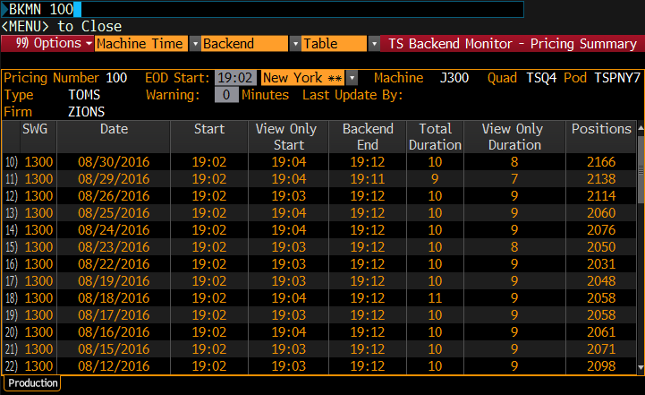

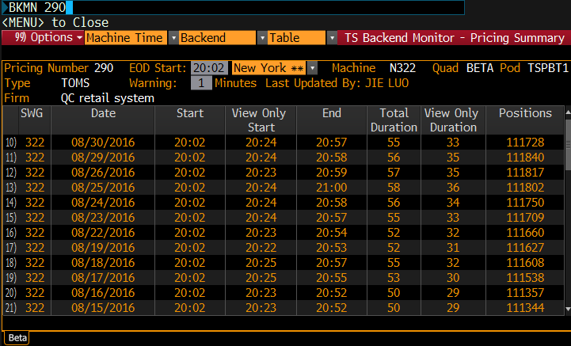

IBM6 has no alias. IBM10 has alias J073.

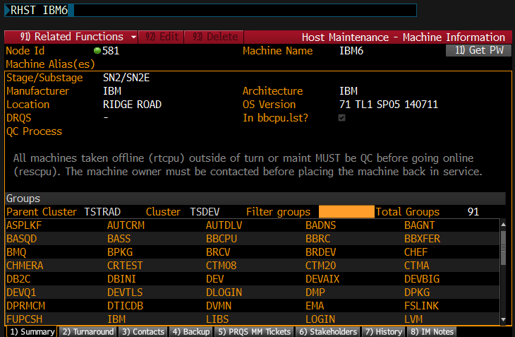

### `TSBT DEV 100` copy pnum 100 to dev machin

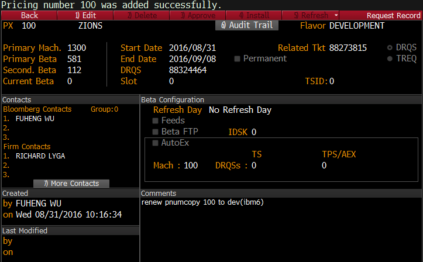

## Manual Test

#### `LOGA` into pnum290

Please make sure you have LOGA access to one of the Beta systems on TSRND ( The RETAIL290 logic for PNUM 290 would be ideal.  If you don't have access, run LOGA, and then run 96<GO> from the LOGA screen to request access to RETAIL290 ).

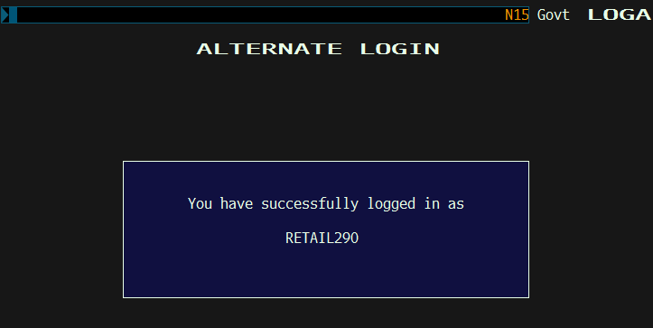

After you have run LOGA to connect to PNUM 290, you could do the following ...

> NTN RICH <GO>

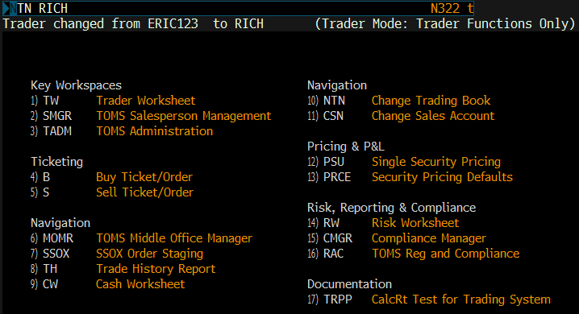

> UHLT <GO>   ( or TW <GO> )

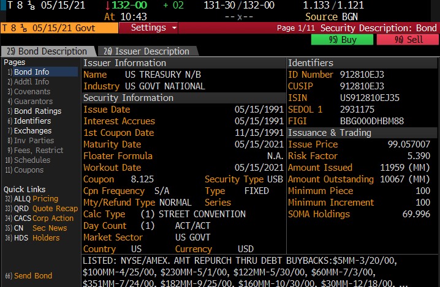

Select a security from the UHLT or TW list.


Run `SPUP` on the security to make sure `SPUP` data was loaded by your new phload for the dates you new phload has been on TSRND.  Assuming that the phload you rolled to TSRND today was linked off your latest bbgithub code, you can check SPUP for 8/30/16.

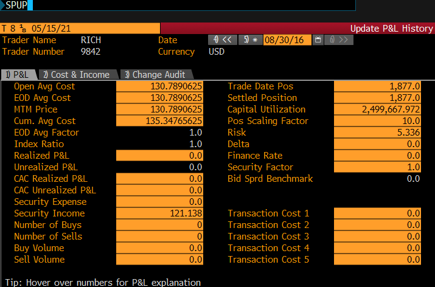


Assuming data was loaded to SPUP correctly, you should check if your new phload functionality will update MTM price and unrealized P&L correctly.  You should pick one or more example securities, and update the MTM and Unrealized P&L fields on SPUP to bad values.  You should also set some other SPUP fields ( like avarage cost to realized P&L ) to bad values.

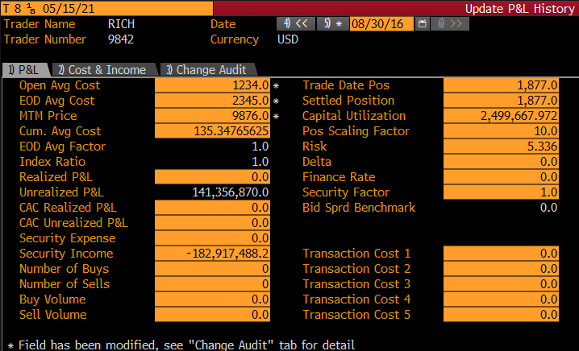


You should enter a PRQS EX to run phload to fix MTM price and Unrealized P&L using last night's f<PNUM>hsec.ext file.
```
n322:op1> ls -al `pxdir 290 ext`/f290hsec.ext
-rw-rw-r--   1 op       general  36347808 Aug 30 20:32 /ts/pod/px/px290/ext/f290hsec.ext
```
Run this command in 
```
#!/usr/bin/ksh
. /bb/bin/oracle.client11
phload.tsk -t 5 -f /ts/pod/px/px290/ext/f290hsec.ext -x 5,18 290 >/ts/pod/px/px290/log/plhlogs/phload_290.log 2>&1
```

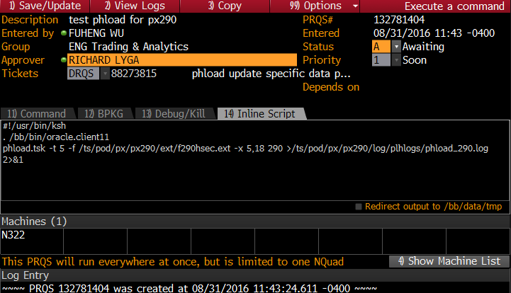

After the PRQS is approved, we can check if the MTM price and unrealized P&L are fixed by phload.tsk.

Check the log file which I have specified in the inline script:

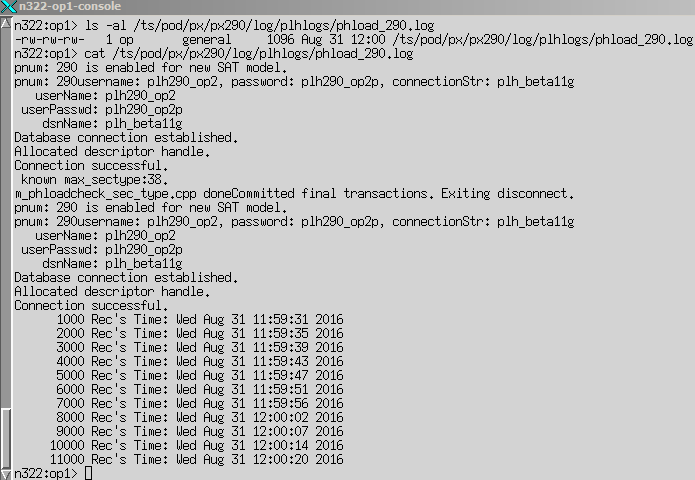

Run SPUP again:

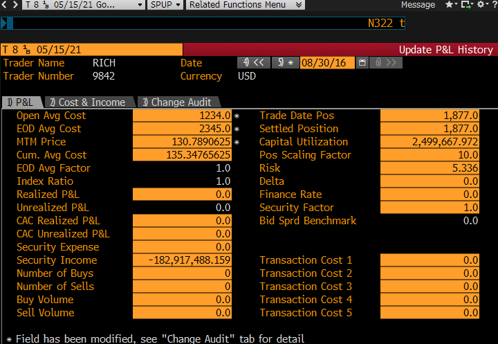

We can see the command succeeded and MTM price and unrealized P&L are fixed!

结束!